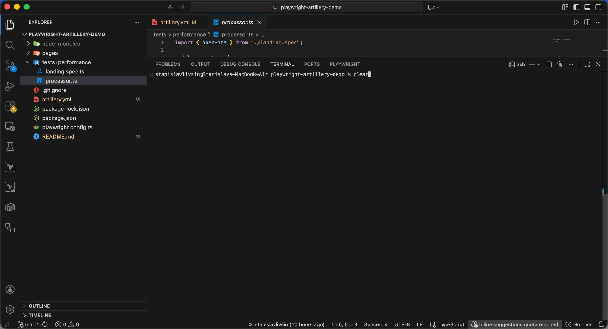

# Playwright Artillery Demo

This project demonstrates how to integrate Playwright with Artillery for performance testing web applications. It showcases running load tests using Playwright's browser automation capabilities through Artillery's load testing framework.

## Demo



## Overview

The demo performs a simple load test against the [Restful Booker](https://restful-booker.herokuapp.com/) website by:

1. Navigating to the landing page
2. Verifying the page title
3. Running the test under load (5 arrivals per second for 30 seconds)

## Prerequisites

- Node.js (version 16 or higher)
- npm or yarn

## Installation

1. Clone or download this repository
2. Install dependencies:

```bash
npm install
```

## Usage

Run the performance test using Artillery:

```bash
npm test
```

This will execute the load test as configured in `artillery.yml`.

## Project Structure

```
├── artillery.yml          # Artillery configuration file
├── package.json           # Project dependencies and scripts
├── playwright.config.ts   # Playwright configuration
├── pages/
│   └── landing.ts         # Page Object Model for the landing page
└── tests/
    └── performance/
        ├── landing.spec.ts # Playwright test function
        └── processor.ts    # Artillery processor exporting test functions
```

## Configuration

### Artillery Configuration (`artillery.yml`)

- **Target**: `https://restful-booker.herokuapp.com/`
- **Load Pattern**: 5 arrivals per second for 30 seconds
- **Engine**: Playwright
- **Test Function**: `openSite` from the processor

## How It Works

1. **Artillery** orchestrates the load test, spawning virtual users according to the configured phases
2. Each virtual user runs the Playwright test function `openSite`
3. **Playwright** automates browser interactions:
   - Navigates to the landing page
   - Extracts and verifies the page title
4. Artillery collects metrics on response times, success rates, and other performance indicators

## Test Details

The `openSite` function:
- Creates a `LandingPage` instance
- Navigates to the root path (`/`)
- Retrieves the title text from the `h1` element
- Asserts that the title equals "Welcome to Restful-Booker"

## Extending the Demo

To adapt this demo for your own application:

1. Update the `target` URL in `artillery.yml`
2. Modify the `LandingPage` class to match your application's structure
3. Add more test functions in `landing.spec.ts` and export them in `processor.ts`
4. Adjust load patterns in `artillery.yml` as needed

## Dependencies

- **@playwright/test**: Browser automation framework
- **artillery**: Load testing toolkit
- **@types/node**: TypeScript definitions for Node.js